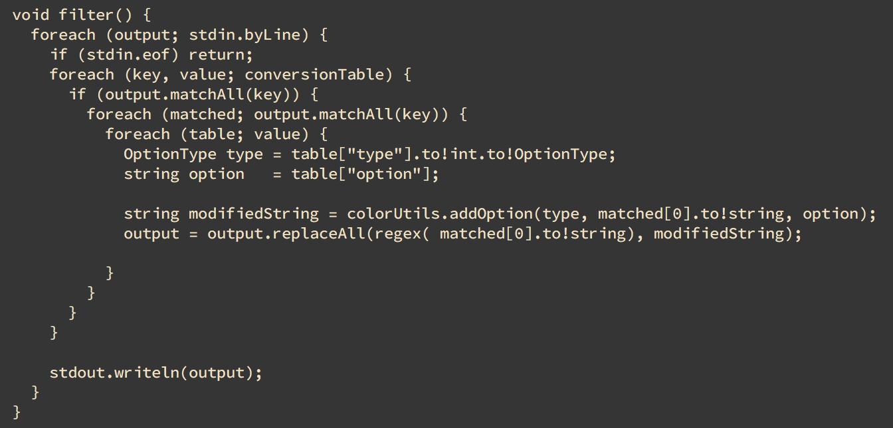
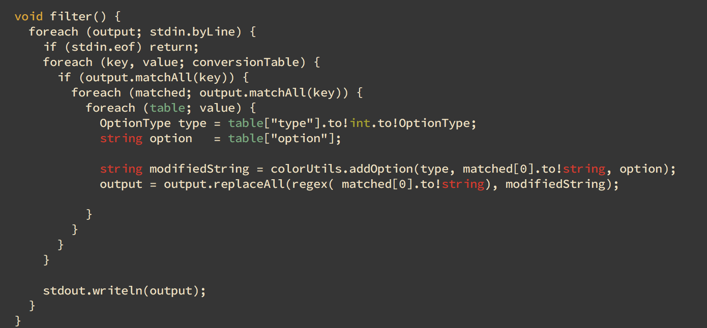

#StreamFilter
#What is?
Tool of standard output filter.  
If you are using command-line based applicaton and you want to filter the output of them(Ex: log).  
Using grep is one of the solution but grep cut the line which dosen't match the pattern.  
Therefore if you need all of outputs whether the line is matched or not such a solution is not perfect.  
StreamFilter can keep the line which doesn't match the pattern and color.  

#Screenshots
Before : ` $ cat source/StreamFilter/filter.d`  
  
After : ` $ cat source/StreamFilter/filter.d | ./streamfilter --regexs=table=f-cyan,string=f-red,int=f-green,void=yellow`  
  

#Installation
If you don't installed the requirements you must install before.  
##Requirements
* Latest DMD  
* Latest DUB (DUB is a package manager and build tool of D)  
  
```zsh
$ git clone https://github.com/alphaKAI/StreamFilter
$ cd StreamFilter
$ dub
```

#Usage
If you want to color one target:  
`$ program | streamFilter --regex=TARGET(you can use D's regex)=COLORING_OPTION(1), COLORING_OPTION(2)....`  
If you want to color some targets:  
`$ program | streamFilter --regexs=TARGET(you can use D's regex)=COLORING_OPTION,TARGET(2)=COLORING_OPTION...`  
  
TARGET example:  
`\\w*\\.d` -> matchs `foo.d`, `bar.d`(By specifications it is necessary that escaping by yourself.)  
`foo` -> matche `foo`, `foobar`  
  
COLORING_OPTION example:  
Style is : [TYPE]-[OPTION]  
Type is divided into three classes:  
  
* Text attribution : `t` or `text`  
* Foreground color : `f` or `fg`
* Background color : `b` or `bg`
  
## Options of text attribution
`bold`, `underscore`, `reverseVideo`(Revese the color of foreground and Background)  
## Colors
`red`,`yellow`, `green`, `magenta`, `bulue`, `cyan`, `white`  
Available colors are limited, for I considered the visibility on terminal.  


#LICENSE
The MIT License.  
Copyright (C) 2016 alphaKAI http://alpha-kai-net.info
